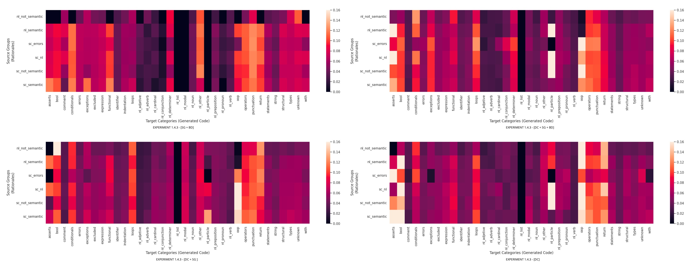
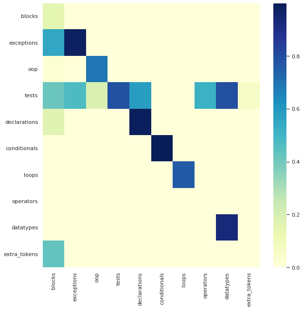
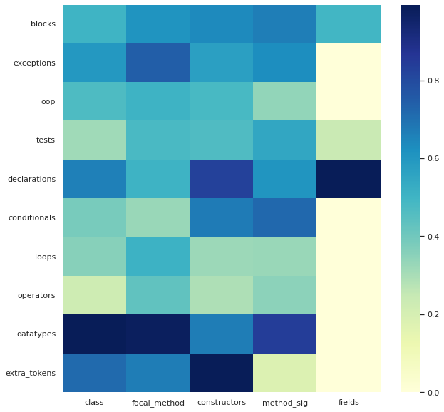
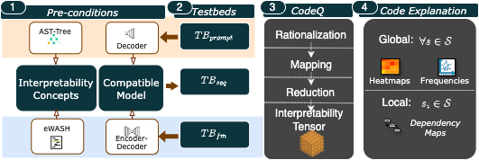
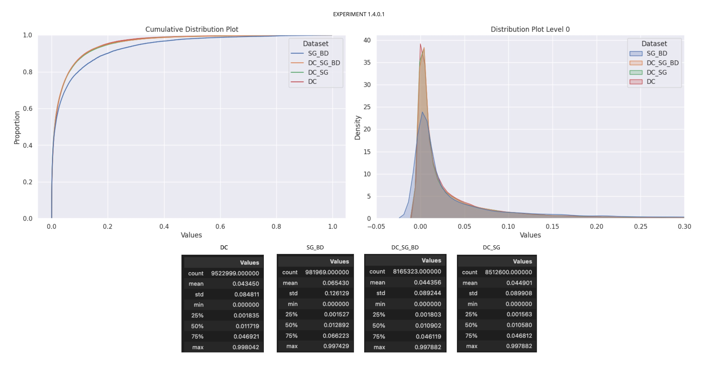
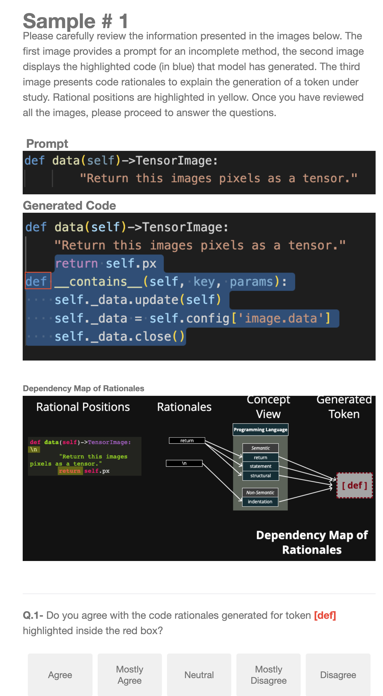

# Why is Accuracy Not Enough for Interpretability?   On Rationalizing Language Models For Code 

In recent years, Language Models for Code (LMC) have significantly changed the landscape of software engineering (SE) on downstream tasks, such as code generation, by making software development more efficient. Therefore, a growing interest has emerged in further evaluating these Language Models to homogenize the quality assessment of generated code. As the current evaluation process can significantly overreact on accuracy-based metrics, practitioners often seek methods to _intepret_ LMC outputs beyond canonical benchmarks. While the majority of research reports on code generation effectiveness in terms of expected ground truth, scant attention has been paid to LLMs' explanations. In essence, the decision-making process to generate code is hard to interpret. To bridge this evaluation gap, we introduce _code rationales_ (**CodeQ**), a technique with rigorous mathematical underpinning, to identify subsets of tokens that can explain individual code predictions. We conducted a thorough _Exploratory Analysis_ to demonstrate the method's _applicability_ and a _User Study_ to understand the _usability_ of code-based explanations. Our evaluation demonstrates that **CodeQ** is a powerful interpretability method to explain how (less) meaningful input concepts (i.e. natural language particle `at') highly impact output generation (i.e. code conditionals). Moreover, participants of this study highlighted **CodeQ's** ability to show a causal relationship between the input and output of the model with readable and informative explanations on _code completion_ and _test generation_ tasks. Additionally, **CodeQ** also helps to uncover model rationale, facilitating comparison with a human rationale to promote a fair level of trust and distrust in the model.

This repository is an online appendix to the ICSE '25 paper titled _"Why is Accuracy Not Enough for Interpretability? On Rationalizing Language Models For Code."_ It includes expanded material from the evaluation and links to the data and code. 

Below **CodeQ** artifacts links are published such as experimental notebooks, scripts, survey raw data, and analysis. The code repository for implementing the interpretability analysis is attached. We also explain the code rationales approach design and showcase an example of our survey, which proves the approach's usability.

---------

## Code Rationales Artifacts

| **Artifact**           | **Repository Folder**     | **Description**                                                                                                 |
|------------------------|---------------------------|-----------------------------------------------------------------------------------------------------------------|
| _Documented Notebooks_ | results_analysis/rq1_exploratory_analysis    | Statistical analysis for _global explanation_ it include extended figures with rationales of different datasets |
| _User study analysis_  | results_analysis/rq2_user_study          | Spreadsheets with participant answers and statistical summarization                                             |
| _Source Code_          | nbs                       | [nbdev](https://nbdev.fast.ai/) format notebooks with the code rationales experimentation                       |
| _Source Code_          | code_rationales           | Generated code by nbdev as a python library                                                                     |
| _Source Code_          | scripts                   | External libraries and utilities for running rationales experiments                                                 |
| _Models_               | **_Upon paper acceptance_** |                                                                                                                 |
| _Testbeds_    | **_Upon paper acceptance_** |                                                                                                                 |

### Documented Notebooks
The folder `results_analysis/rq1_exploratory_analysis` contains several books for exploratory analysis on code and test generation.

1. [Exploratory Data Analysis - Frequency of NL and SC](https://github.com/WM-SEMERU/code-rationales/blob/master/results_analysis/rq1_exploratory_analysis/code_completion/1_frequency_nl_sc.ipynb)
2. [Exploratory Data Analysis - Distribution of Meaningful and Meaningless Concepts](https://github.com/WM-SEMERU/code-rationales/blob/master/results_analysis/rq1_exploratory_analysis/code_completion/2_distribution_meaningful_meaningless_rationales.ipynb)
3. [Exploratory Data Analysis - Distribution of Rationales Probabilities Across Different Datasets](https://github.com/WM-SEMERU/code-rationales/blob/master/results_analysis/rq1_exploratory_analysis/code_completion/3_distribution_rationales.ipynb)
4. [Exploratory Data Analysis - Proportionality of NL and SC](https://github.com/WM-SEMERU/code-rationales/blob/master/results_analysis/rq1_exploratory_analysis/code_completion/4_proportionality_nl_sc.ipynb)
5. [Exploratory Data Analysis - Dependencies between rationales and targets](https://github.com/WM-SEMERU/code-rationales/blob/master/results_analysis/rq1_exploratory_analysis/code_completion/5_dependencies_between_rationales_targets.ipynb)
6. [Test generation - Local Analysis](https://github.com/WM-SEMERU/code-rationales/blob/master/results_analysis/rq1_exploratory_analysis/test_generation/4_local_rationales.ipynb)
7. [Test generation - Global Analyisis](https://github.com/WM-SEMERU/code-rationales/blob/master/results_analysis/rq1_exploratory_analysis/test_generation/3_global_statistics_ratio_ewash.ipynb)

After running the experiments across suggested datasets or testbeds, we registered and stored different analyses for each set. The **captures** folders under `rq1_exploratory_analysis/code_completion` and `rq1_exploratory_analysis/test_generation` contain snapshots of statistical analysis (e.g., distributions, heatmaps, histograms). For example, the image below depicts a global analysis of rationales using a heatmap, which connects the input rationales and generated code. Code tokens were clustered by concepts at the AST levels 1 and 2.

### Global Analysis for Test Generation (using eWASH). 

This heatmap shows the impact of the input rationale ($X$ axis) and generated test ($Y$ axis) grouped by concepts located at the focal method. Notice that `data_types' impact tests. This heatmap is generated using an encoder-decoder transformer (i.e., BART). The decoder processes the focal method as a sequence and the encoder generates the linked focal _test_ method. More examples and information can be found at [eWASH encoder-decoder notebook](https://github.com/WM-SEMERU/code-rationales/blob/master/results_analysis/rq1_exploratory_analysis/test_generation/2_global_statistics_ratio_ccp.ipynb)

The following heatmap demonstrates the impact of an input-output of the decoder transformer (of BART) for test case generation. We applied **Code-Q** on the decoder part of BART to interpret a generated test. Note the relevance of a focal method as a rationale concept against other contexts such as class, fields, or constructors. For instance, we observe that `fields' only impact declarations, test declarations, and blocks. More examples can be found at [Bart decoder notebook analysis](https://github.com/WM-SEMERU/code-rationales/blob/master/results_analysis/rq1_exploratory_analysis/test_generation/3_global_statistics_ratio_ewash.ipynb)

### User Study Artifacts

This folder contains raw data from our user study and CSVs where we aggregated the results and performed statistical analysis based on our research questions.
1. [Raw data of user responses in CSV format](https://github.com/WM-SEMERU/code-rationales/blob/master/results_analysis/rq2_user_study/CodeRationalSurveyResponses.csv) This file contains raw data of every user responses in CSV format. Each column in the CSV records raw answers to every question we asked in the survey. The personal information of the user is omitted for privacy reasons.
2. [Collection of all the user responses and statistical analysis from Qualtrics](https://github.com/WM-SEMERU/code-rationales/blob/master/results_analysis/rq2_user_study/ResponseForEachQuestion.pdf) This file contains all the information of the users grouped by standard statistical analysis performed using Qualtrics features. 
3. [Taxonomy of error cases analysis](https://github.com/WM-SEMERU/code-rationales/blob/master/results_analysis/rq2_user_study/Errors%20Taxonomy%20-%20Samplings.xlsx) In this file, we present our error case analysis of model prediction. We categorize different types of errors in the model prediction using existing literature. We show some samples for each error type.
4. [Survey Evaluation based on our metrics including demographic information](https://github.com/WM-SEMERU/code-rationales/blob/master/results_analysis/rq2_user_study/Survey_evaluation.xlsx) This file contains various sheets with the evaluation of the survey based on our metric. The sheets correspond to demographics, usefulness, reliability, readability, and alignment. We also show an aggregation of all the data in a table in the final sheet in this file.   

---------

## Code Rationales Approach Description

**CodeQ** comprises four steps to transform an interpretability tensor from the matrix representation of the input and input set of tokens and their relationships. 

1. **Stating Preconditions**: The first step involves preparing the necessary conditions for using the  method to interpret an LMC. This includes making the model compatible using a specific algorithm and structuring "interpretable concepts," which are meant to introduce understandable concepts related to the model's input-output. These concepts are tailored to software engineering (SE) tasks. Two types of interpretability concepts are proposed: one based on Abstract Syntax Tree (AST) for code generation, and the other on focal methods for test case generation.

2. **Constructing Testbeds**: The second step builds testbeds by selecting and configuring the model's input, depending on the SE task and interpretability concepts. For example, prompts are used to build a testbed for code generation, and the generated code is concatenated with the prompt to form a new testbed for applying **CodeQ**, which is referred to as a set of generated snippets.

3. **Building Interpretability Tensors**: The third step involves applying the **CodeQ** method, which is designed to interpret predictions made by language models. **CodeQ** is compatible with both encoder-decoder and decoder-only models and introduces three mathematical components to transform tokens from a snippet into an "interpretability tensor".

4. The interpretability approach uses the tensor $\Phi$ to generate local post hoc explanations, such as dependency maps. These maps reveal three levels of human-interpretable concepts: 
- $L_1$: fine-grain level rationales (i.e., tokens), 
- $L_2$: concept rationales (e.g., noun, preposition, identifier), 
- $L_3$: modality (e.g., natural language or programming language).

Additionally, the interpretability tensor can be explored further to generate post hoc global explanations.

### Research Questions

* **RQ1 [Applicability]:** *How applicable is **CodeQ** to globally interpret code generation?* This RQ explores the use of **CodeQ** in creating understandable explanations for the behavior of language models in code generation tasks. The hypothesis is that greedy rationalization can identify key rationales leading to predictions, providing insights into the model's prediction dependencies.

* **RQ2 [Usability]:** *How useful is **CodeQ** in practical settings?* This RQ assesses the practical usefulness of **CodeQ** through a user study, evaluating qualitative metrics such as usefulness, reliability, readability, and how well **CodeQ** helps in aligning language models.

---------

## Intepretability Concepts $\mathcal{C}$ for Code Generation

We propose two concept aggregation sets $\mathcal{C}$: one for code generation and one for test generation. The first set is based on Abstract Syntax Trees (ASTs), allowing tokens to be associated with Object-Oriented Programming (OOP) concepts. We also incorporated natural language (NL) concepts using [NLTK](https://www.nltk.org) to map and explain AST nodes like comments and identifiers. The second set is based on context windows from [eWASH](https://github.com/microsoft/methods2test). The following figure illustrates on the left (1) case(a) code generation example and the erroneously generated code, case (b) a test generation example. On the right (2) interpretability concepts for code generation.

---------
## Dataset Analyses

The cumulative probability of concepts per dataset. We observe that datasets with docstring (DC) grow faster than the ones with only source code (signature (SG) and body (BD)). 

The following figure shows the size of focal methods (in blue) and focal test methods (in orange) used in our analysis. The average size of a focal method in terms of tokens is between $10^2$ and $10^3$ on average. Meanwhile, a focal test method has on average $10^2$ tokens. This is expected since methods are usually larger than their corresponding unit test. The testbed has a 1-1 relation on the number of tests and methods; therefore, the distributions have similar Gaussian shapes.

---------

## Survey Generic Example

In this image, we show one of the samples presented in the survey. The sample was selected based on our analysis of error cases. The image depicts our technique of presenting rationales behind predictions and also captures whether the users agree with the generated rationales. By exposing users to **CodeQ**, we assessed the informativeness and readability of our diagrams. The remaining samples in the survey follow the same structure.

